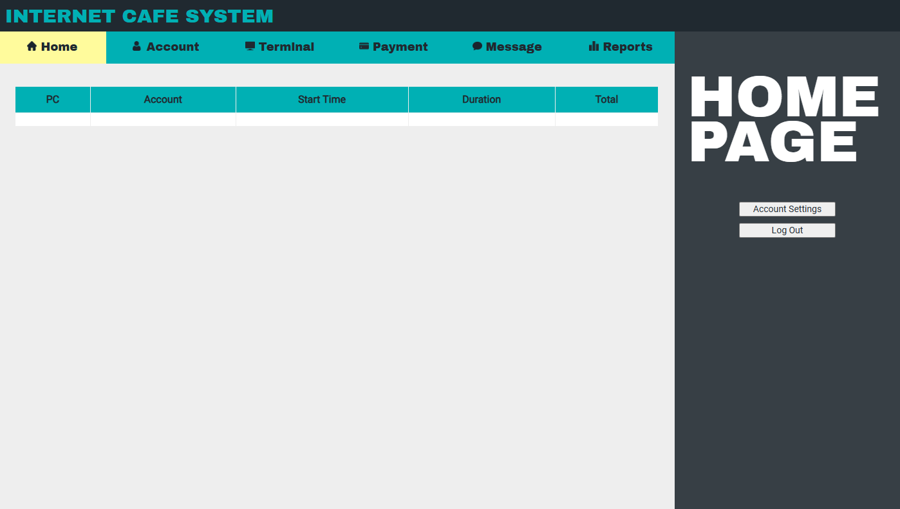

# Internet Cafe Management Software

  

Authors: [Ryan Caabay](https://www.linkedin.com/in/ryancaabay/) · [Katrina Silao](https://www.linkedin.com/in/katrina-julie-ann-silao-5396682a2/) · [Kurt Zacarias](https://www.linkedin.com/in/kurt-jayson-zacarias-982150b1/)

This code implementation, focusing on an Internet Cafe Management System, was developed as a prerequisite for our course Software Engineering 1. In many internet cafes, manual processes are still used to manage user details and transaction records. Here in the Philippines, owners and staff typically record all financial reports in a logbook. They assist customers by assigning them to terminals and asking how many hours they wish to use the computer or if they prefer an open-hour session.

To satisfy this essential course requirement and meet the study objectives, the Internet Cafe System was designed to automate these processes and update information in the database automatically. The system can manage any number of workstations, enabling business owners to streamline operations without the need for additional staff.

